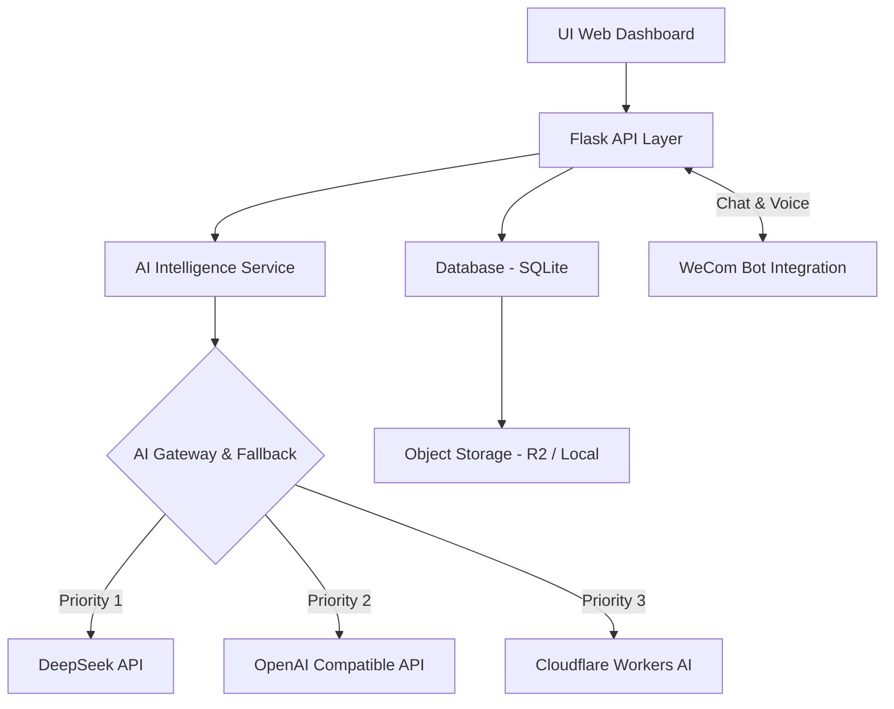

# 🏥 ICU & Anesthesia Project Management Platform (ICU-PM)
> **Intelligent Healthcare Implementation Management Powered by AIGC**


这是一套专为**重症及手麻医疗信息化实施项目**高度定制的智能管理系统。它结合了传统项目管理（PM）的严谨性与现代 AIGC 技术的高效性，旨在解决医疗现场复杂、碎片化的沟通与进度管理痛点。

---

## 💎 卓越特性

### 🧠 神经网络式 AI 驱动 (The Brain)
*   **多源模型冗余架构**：内置 DeepSeek, Cloudflare AI 等多模型网关。系统具备“自愈”能力，当首选供应商宕机时，秒级无缝倒换至热备节点。
*   **企业微信深度集成**：支持企微群机器人自动化推送，以及直接与企微机器人进行文字/语音交互。首创 **WeCom 语音解析**，通过本地化转写支持实时语音派发任务和查询状态。
*   **全局与项目级周报自动生成**：自动抓取全量活跃项目的进度、阻塞点和近期里程碑。**具备智能长效缓存机制**，极大节省 Token 开销的同时保证出报速度。能够清洗脏数据并输出格式齐整的高管视角的周报。
*   **AI 智能诊断雷达 (Sentiment Radar)**：深度诊断进度与风险项，提取核心负向信号，生成多维风险雷达图直观展现健康度。
*   **智能化语义归纳**：深度结合语境生成“晨会简报”以及“阶段性会议纪要”。

### 🏗️ 核心工程模型
*   **全局甘特图生态 (Gantt Chart)**：多级进度把控，自动计算任务的最优路径，直观展示里程碑完成度。
*   **财务与收入监控**：新增全生命周期**项目收入追踪模型**，结合原有的费用报销系统，精准测算项目整体利润率。
*   **云原生改造**：支持本地硬件部署，同时已全面打通 **Cloudflare R2 对象存储**，解决本地大文件（项目文档、验收资料）的长期归档难题。
*   **资产与协同闭环**：包含软硬件资产绑定、知识库管理系统，同时深度打通 Notion API 以便形成完整的双向项目数字化网络档案。

### 🎨 极客级交互设计
*   **Premium Glassmorphism UI**：基于现代审美打造的深色、半透明视觉系统，配合精美的动效和图表。
*   **所见即所得的极速体验**：具备完善的全局状态保活和缓存策略，避免长时间等待。

---

## 🛠️ 系统架构



---

## ⚙️ 部署指南 (私有化)

### 1. 软件环境
*   **Python 3.10+** (推荐 3.11)
*   **SQLite 3**
*   **FFmpeg** (用于企微 AMR 语音转写处理)

### 2. 初始化步骤
```bash
# 获取源码
git clone https://github.com/QS1314520ZHOU/icu_anesthesia_project.git
cd icu_anesthesia_project

# 安装核心依赖
pip install -r requirements.txt

# 启动服务 (首次启动将自动构建数据库)
python app.py
```

### 3. 系统初始化配置
进入系统后，点击侧边栏 **“系统管理中心”**：
1. **AI 配置**：设置 DeepSeek 或对应兼容 API 的 Token。
2. **云存储配置 (可选)**：设置您的 S3/R2 认证密钥。
3. **企微配置 (可选)**：绑定您的企业微信应用 ID/Secret 以及接收消息的 Webhook URL。

---

## 🛡️ 数据隐私与安全
*   **灵活隔离**：所有结构化财务和项目数据均存储在本地 SQLite 中。您可以自行决定文档是存在本地服务器还是上传至加密云端。
*   **脱敏调用**：AI 接口调用仅传输业务逻辑相关的无害文本片段，且支持在服务端一键熔断所有云端通讯。

---

## 📅 版本迭代追踪
- [x] AI 全局实施周报自动化生成与容错清理
- [x] 基于 S3 协议的 Cloudflare R2 对象存储接入
- [x] 企业微信（WeCom）回调机器人，支持**原生语音识别**交互
- [x] R2 Endpoint 与路径标准化修复支持
- [x] AI 决策辅助深度安全缓存管控
- [x] 系统级仪表盘更新及项目群整体监控

---
**QS1314520ZHOU**  
*用极客精神与人工智能重塑医疗工程管理流程*
