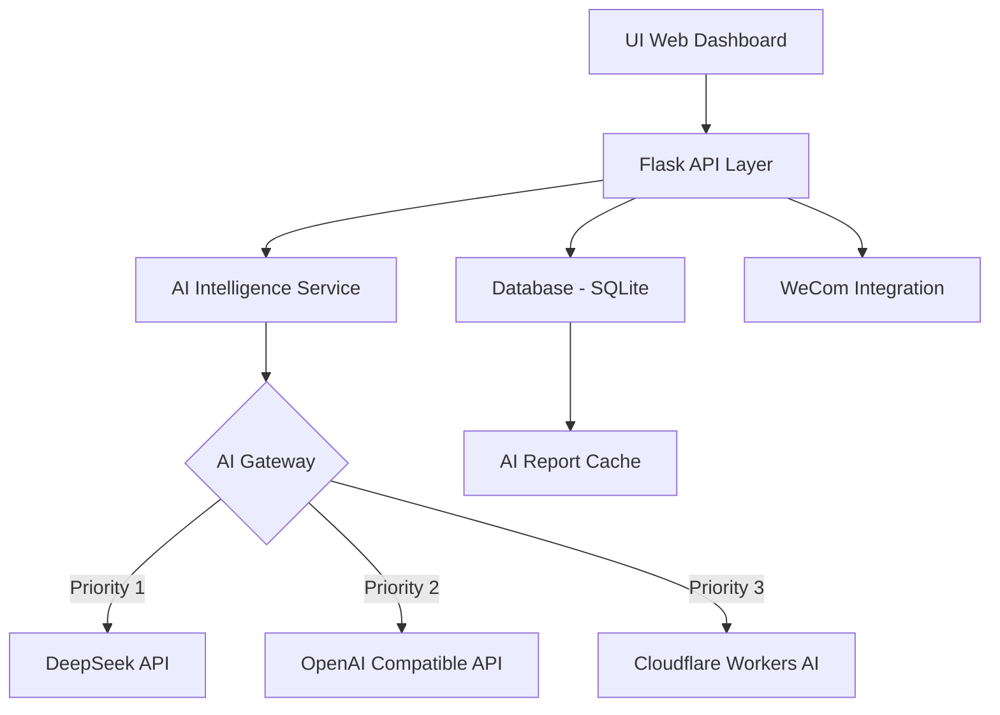

# 🏥 ICU-PM Intelligent Assistant
> **ICU & Anesthesia Project Management Platform Powered by AIGC**


这是一套专为**重症及手麻医疗信息化项目**定制的智能管理系统。它结合了传统项目管理（PM）的严谨性与现代 AIGC 技术的高效性，旨在解决医疗工程现场复杂、碎片化的沟通与进度管理痛点。

---

## 💎 卓越特性

### 🧠 神经网络式 AI 驱动 (The Brain)
*   **多源模型冗余架构**：内置 Cloudflare AI (Qwen/Llama) 与 DeepSeek 双重引擎。系统具备“自愈”能力，当首选供应商宕机时，秒级无缝倒换至备份节点。
*   **AI 今日决策辅助**：自动抓取全量活跃项目的进度、阻塞点和近期里程碑，并**具备智能缓存机制**，在节省 Token 的同时提供秒级的决策建议。
*   **AI 情感雷达 (Sentiment Radar)**：深度分析项目日志与风险项，提取核心负向信号（增加至5个关键词），并通过雷达图直观展现客户、团队、技术与进度的健康度。
*   **智能化语义归纳**：
    *   **每日“晨会简报”**：生成逻辑清晰的行为建议。
    *   **站会分钟生成**：将碎片化的现场日志通过 LLM 聚合为标准的专业纪要。
*   **企业微信深度集成**：支持多级 Webhook 配置，实现项目预警、日报的自动化分发。

### 🏗️ 核心工程模型
*   **CPM 关键路径法**：自动计算项目最短工期，动态识别可能导致延期的“致命节点”。
*   **影响域分析 (Impact Analysis)**：当需求变更或任务延误时，AI 自动推演其所在的整个下游链条的影响范围。
*   **可视化数据导出**：支持报表级 PDF 导出，采用 DOM 克隆技术解决复杂长页面的导出黑屏/截断问题。
*   **数据资产闭环**：支持项目文档归档、支出追踪、验收管理，形成完整的项目数字化档案。

### 🎨 极客级交互设计
*   **Premium Dark UI**：基于现代审美打造的深色、半透明（Glassmorphism）视觉系统。
*   **实时交互反馈**：具备完善的全局 Toast 气泡系统与加载状态反馈，确保在大模型计算过程中交互不卡顿。

---

## 🛠️ 系统架构



---

## ⚙️ 部署指南 (私有化)

### 1. 软件环境
*   **Python 3.10+**
*   **SQLite 3**

### 2. 初始化步骤
```bash
# 获取源码
git clone https://github.com/QS1314520ZHOU/icu_anesthesia_project.git
cd icu_anesthesia_project

# 安装核心依赖
pip install -r requirements.txt

# 启动服务 (首次启动将自动构建数据库)
python app.py
```

### 3. 配置 AI 节点
进入系统后，点击侧边栏 **“AI 配置管理”**，您可以直接在 UI 界面配置您的 API Token。配置会自动实现数据库持久化，无需修改源代码。

---

## 🛡️ 数据隐私与安全
*   **本地存储**：所有项目核心数据、财务记录均存储在本地 SQLite 中，不上传云端，满足医疗行业合规性需求。
*   **脱敏调用**：AI 接口调用仅传输业务逻辑相关的文本片段，且支持在配置中心随时停用任何外部 API。

---

## 📅 Roadmap
- [x] AI 晨会简报自动化推送
- [x] Cloudflare 多模型备份系统
- [x] AI 决策辅助缓存机制 (Daily Caching)
- [x] 情感雷达多维评分系统
- [x] 报表级 PDF 导出优化
- [x] 甘特图 (Gantt Chart) 展示
- [ ] 移动端小程序适配
- [ ] 自动化运维健康检查看板

---
**QS1314520ZHOU 荣誉出品**  
*致力于用人工智能重塑医疗工程管理流程*
